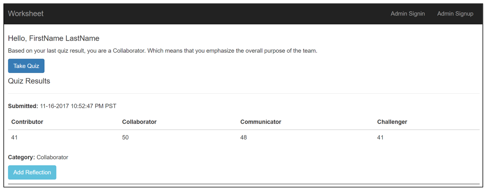
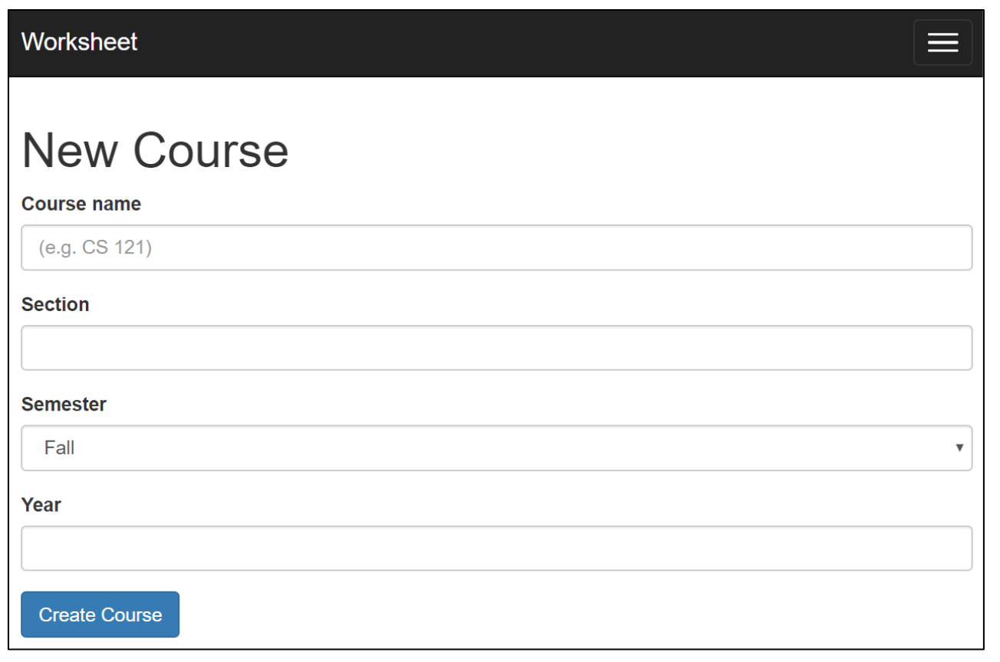

# Parker Team Player Quiz 

## Description

This application will allow students to digitally take the Parker Team Player Style quiz and see their score for each Team Player category. The students can then write a reflection of their results. Students will be able to take the quiz multiple times and write a reflection. Students will be able to view their own results and reflections for all the quizzes they have taken. Administrators can organize students to see all the results of one class. The administrator will also be able to export the results of each class. 

## Minimum Viable Product

Our application will have a student interface and an admin interface. In the student interface students have the ability to take the quiz and to see their own results. On each student’s dedicated page they can see all of their results, sorted by most recent, and corresponding reflections written by them. In the admin interface, the admin will have the ability to view all the results from students in different classes, and they will have the ability to export all the student data for a specific class.
 
The students will be organized into classes created by the admin. This allows the admin to view the students in a specific class. The students will not have the ability to create a class or put other students, including themselves, into a class. This feature will only be implemented in the admin interface. The class will have the name of the students that belong to the class. This allows the admin to access the data for all the students.

**Admin Interface**  
The admin will login after creating an account with their email and password. They will then be redirected to a page that has all their classes. They will be able to click on a class and be redirected to that class page. They will also be able to click somewhere on the page with all the classes, to create a new class. For a specific class page, the admin will see a table of all the names of the students in the class with their most recent quiz result and most recent reflection. They will also be able to import new students and manually add new students to that class page. The admin can then click on a student and they will be redirected to the unique student page where they can see all the results for that student. The admin will also be able to click a button to export all the data for a specific class. 
	
**Student Interface**  
The student will first see a page where they are prompted to enter their student ID. They will then be redirected to their own unique student page. The student will see all their quiz results and all their reflections. They are sorted so that the student can quickly see their most recent quiz results and reflections. The student will also have a button that they can press to take/retake the quiz. They will also have a button to submit a new reflection. Both buttons will redirect the students to corresponding pages. The take/retake quiz button will redirect them to a page where they will be able to take the quiz. The new reflection button will redirect them to a page where they will be able to write their reflection. See figures 1 and 2.


## Requirements

* [Ruby 2.3+](https://www.ruby-lang.org/en/)
* [Rails 5+](http://rubyonrails.org)

## Run on localhost
First you will need to clone the project and go into its directory.  
```git clone https://github.com/famendola1/Worksheet-Digitalization.git```

```cd Worksheet-Digitalization```

Next, run the following commands:
* ```bundle install```, installs the necessary Ruby gems if not installed
* ```rake db:migrate```, migrates the most recent version of the database
* ```rake assets:precompile```, precomiles javascript, stylesheets, etc.
* ```bundle exec figaro install```, This creates a commented ```config/application.yml``` file and adds it to your ```.gitignore```

Creating your invitation code:

Open up the file, ```config/application.yml``` and create a key-value pair for invitation_code. 

```invitation_code: "your_invitation_code"```

Now, to use the app, run ```rails server``` and navigate to localhost:3000 in your browser of choice.

## Architecture

### Admin Simplified

|  type   |  attribute |
|---------|------------|
| Integer | id         |
| String  | email      |
| String  | name       |

We used the ruby gem  [devise](https://github.com/plataformatec/devise) to handle the admin data. The admin data is collected through a form on the sign up page. The data is then stored in the database with columns that are predefined by devise. We added a name column to the database since it wasn't predefined by devise. An admin has many courses

### Course

| type    |  attribute |
|---------|------------|
| Integer | id         |
| String  | name       |
| Integer | section    |
| String  | semester   |
| Integer | year       |
| Integer | admin_id   |

The id is the key attribute for a course and it makes each course unique. The course name, section, semester, and year are for visual purposes. It allows the admin to view course names instead of an id, and the section, semester, and year help distinguish courses with the same name offered in the same semester or different semesters and years. The admin_id is a way to relate the course to a specific admin. A course belongs to an admin and has many students through enrollments.

### Student

| type    |  attribute |
|---------|------------|
| Integer | student_id |
| String  | name       |
| String  | category   |

The purpose of the student id is to make each student unique and should correspond to the student’s school id number. We decided to make the student_id the primary key for students. This was under the assumption that our app will only be used by 5C students, who each have a unique id. To extend our app to multiple schools, a simple change can be made to model such that there are no conflicts. The name for the student is for visual purposes. It helps the admin know who the students are instead of just looking at id’s. The category allows the student and the admin know what kind of team player the student is, which is the purpose of the team player questionnaire. The student also has many courses through enrollment and has many quiz results.

### Enrollment

| type    |  attribute |
|---------|------------|
| Integer | course_id  |
| Integer | student_id |

Enrollments are used to represent the has_many through relationship that exists between courses and students. This relationship allows for courses to have multiple students and for students to be enrolled in multiple courses. In order to have this relationship we need to store all the references to relative foreign keys, which is what this model is used for. An enrollment belongs_to both a course and a student which allows for rails to make this association.

### Quiz Result

| type    |  attribute   |
|---------|--------------|
| Integer | id           |
| Integer | student_id   |
| Integer | collaborator |
| Integer | contributor  |
| Integer | challenger   |
| Integer | communicator |
| String  | reflection   |

The id uniquely identifies each quiz result from one another. Collaborator, challenger, communicator, and contributor store the calculated points for each of those categories from the quiz. The student_id is stored so that each quiz_result also knows about and is linked to the student it belongs to. Reflection holds the student's written repsonse to their quiz results. We chose to not make reflection its own model because it is just a form response and has no attributes. A quiz result belongs to a student and will have 18 answer objects corresponding to how the quiz was answered.

### Answer

| type    |  attribute     |
|---------|----------------|
| Integer | id             |
| Integer | quiz_result_id |
| Integer | question       |
| Integer | responseA      |
| Integer | responseB      |
| Integer | responseC      |
| Integer | responseD      |

The id is the unique identifier of the each answer. The question is which question the answer corresponds to. responseA, responseB, responseC, and responseD correspond to the ranking each of the respones got from completing the quiz. Lastly, it has a quiz_result_id so it can be related to the unique quiz it belongs to.

## Functionality

### Overview
Our application will have a student interface and an admin interface. In the student interface, students have the ability to take the Parker Team Player Style Survey and see their own results. The Parker Team Player Survey poses 18 questions on problems that may occur in a team setting and provides four possible approaches to which the student will rank the four possible answers from most applicable to least applicable. These scores are then totaled to return the team player category to which the student likely belongs: Communicator, Collaborator, Challenger, or Contributor. The results for a survey will have the students highest category and the score for each category. On each student’s dedicated page they can see all of their results, sorted by most recent, and write or view a corresponding reflection for each. In the admin interface, the admin will have the ability to view all the results from students in their different classes, and they will have the ability to export all the student data for a specific class in a csv file.

The students will be organized into classes created by the admin. This allows the admin to view the students in a specific class. The students will not have the ability to create a class or put other students, including themselves, into a class. This feature will only be implemented in the admin interface. The class will have the names of the students that belong to the class. This allows the admin to access the data for all the students as each student name links to their overall quiz results page.

### Admin Interface

#### Admin Login

*Figure 1*

The admin will login after creating an account with their email and password (Figure 1). They will then be redirected to the admin home page.
#### Admin Homepage

*Figure 2*


*Figure 3*

They will be able to click on a course and be redirected to that course page (Figure 2). New courses can be created with the “New Course” button found at the bottom of the list of admin courses. (Figure 3). 
#### Course Page

*Figure 4*


*Figure 5*

For a specific course page, the admin will see a list of all the names of the students in the course (Figure 4). They will also be able to import new students with a csv file containing name and id of a student. The admin can also manually add new students to that class page one at a time (Figure 5)
#### Accessing Student Page
The admin can click on a student and they will be redirected to the unique student page to view all the results for that student.
#### Export Class Data

*Figure 6*

At the bottom of a specific course page, under the list of students of that course, an “Export” button allows the admin to export all the data for a specific class, including the quiz results of all the students in a class with the totaled up categories and the rankings for each question (Figure 6).

### Student Interface

#### Student "Login"

*Figure 7*


*Figure 8*

The student will first see a page where they are prompted to enter their student ID (Figure 7). They will then be redirected to their own unique student page. The student will see all their quiz results and all their reflections (Figure 8). They are sorted so that the student can quickly see their most recent quiz results and reflections.
#### Take/Retake Quiz

*Figure 9*

The student will also have a button that they can press to take/retake the quiz and it will redirect them to the quiz page (Figure 9). 
#### Student Quiz Results

*Figure 10*

The view results button will redirect them to a page with detailed results showing the question and how they ranked their answers within the categories (Figure 10).
#### New Reflection
They will also have a button to submit a new reflection. The new reflection button will redirect them to a page where they will be able to write their reflection.
