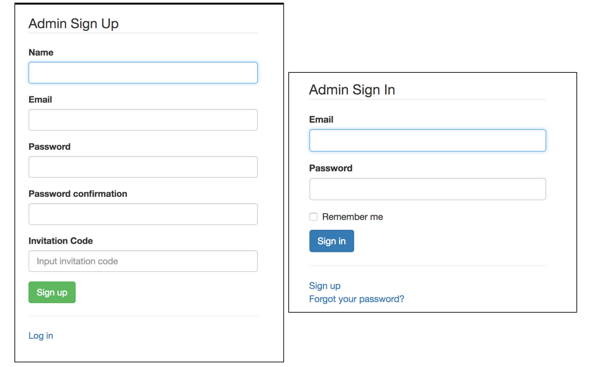
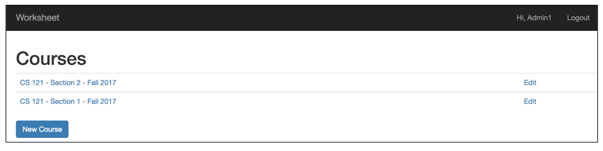
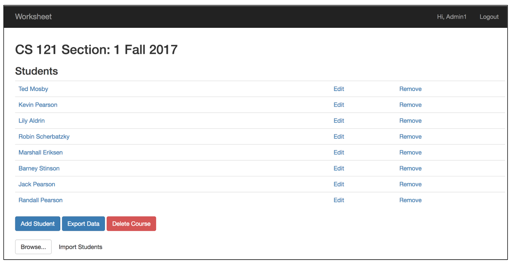
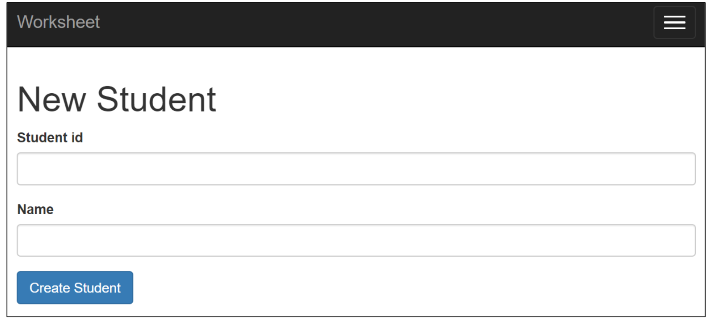
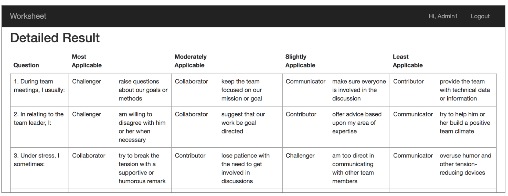

# Parker Team Player Quiz 

## Description

This application allows students to digitally take the Parker Team Player Style quiz and see their score for each Team Player category. The students can then write a reflection of their results. Students are able to take the quiz multiple times and write a reflection. Students can view their own results and reflections for all the quizzes they have taken. Administrators can organize students to see all the results of one class. The administrator can also export the results of each class. 

## Minimum Viable Product

Our application has a student interface and an admin interface. In the student interface students have the ability to take the quiz and to see their own results. On each student’s dedicated page they can see all of their results, sorted by most recent, and corresponding reflections written by them. In the admin interface, the admin has the ability to view all the results from students in different classes, and they have the ability to export all the student data for a specific class.
 
The students can be organized into courses created by the admin. This allows the admin to view the students in a specific class. The students do not have the ability to create a class or put other students, including themselves, into a class. This feature is only implemented in the admin interface. The course has a list of the names of the students that belong to the course. This allows the admin to access the data for all the students.

**Admin Interface**  
The admin can login after creating an account with their email and password. They are then redirected to a page that has all their courses. They can click on a course which redirects them to that specific course page. They can also click the "New Course" button, to create a new course. For a specific course page, the admin sees a list of all the names of the students in the course. They can import new students and manually add new students to a course. The admin can then click on a student and they will be redirected to the unique student page where they can see all the results for that student. The admin can also click the "Export" button to export all the data for a specific course. 
	
**Student Interface**  
The student will first see a page where they are prompted to enter their student ID. They will then be redirected to their own unique student page. The student can see all their quiz results and all their reflections. They are sorted so that the student can quickly see their most recent quiz results and reflections. The student has a button that they can press to take/retake the quiz. They also have a button to submit a new reflection for each quiz result. Both buttons will redirect the students to corresponding pages. The take/retake quiz button will redirect them to a page where they can take the quiz. The new reflection button will redirect them to a page where they can write a reflection. See figures 1 and 2.


## Requirements

* [Ruby 2.3+](https://www.ruby-lang.org/en/)
* [Rails 5+](http://rubyonrails.org)

## Gems

* devise: We used the ruby gem devise to handle the admin data,collected through a form on the sign up page and later stored in the database with columns that are predefined by devise. 
* bootstrap: We used the ruby gem bootstrap to design and improve our site visually.
* figaro: We used the ruby gem figaro to store the admin invitation code.

## Run on localhost
First you will need to clone the project and go into its directory.  
```git clone https://github.com/famendola1/Worksheet-Digitalization.git```

```cd Worksheet-Digitalization```

Next, run the following commands:
* ```bundle install```, installs the necessary Ruby gems if not installed
* ```rake db:migrate```, migrates the most recent version of the database
* ```rake assets:precompile```, precomiles javascript, stylesheets, etc.
* ```bundle exec figaro install```, This creates a commented ```config/application.yml``` file and adds it to your ```.gitignore```

Creating your invitation code:

Open up the file, ```config/application.yml``` and create a key-value pair for invitation_code. 

```invitation_code: "your_invitation_code"```

Now, to use the app, run ```rails server``` and navigate to localhost:3000 in your browser of choice.

## Additional Admin Information
### Admin Verification Code
Currently there is one global code for all the admins.

### Student Interactions
Admins can add students to a course even if they did not create the student. They can add the student if they know their ID and name. 
Deleting a student means removing them from the course, which means that the student still exists. This means a student can exist even if they have been deleted from all courses. The student can still be added to a course again, because there student data still exists.

### Import and Export
You can find examples of a file to import and an example exported file in the examples folder. 
## Architecture

### Admin Simplified

|  type   |  attribute |
|---------|------------|
| Integer | id         |
| String  | email      |
| String  | name       |

We used the ruby gem  [devise](https://github.com/plataformatec/devise) to handle the admin data. The admin data is collected through a form on the sign up page. The data is then stored in the database with columns that are predefined by devise. We added a name column to the database since it wasn't predefined by devise. We also have an invitation code for admin registration. We create a virtual attribute to the admin model via attr_accessor which is validated when an admin tries to register. We store the invitation code with the gem [Figaro](https://github.com/laserlemon/figaro). Figaro creates an application.yml file where the invitation is stored as a key-value pair (invitation_code: "our_code"). Figaro automatically adds application.yml to .gitignore, which ensures that the invitation code does not get pushed to GitHub.


### Course

| type    |  attribute |
|---------|------------|
| Integer | id         |
| String  | name       |
| Integer | section    |
| String  | semester   |
| Integer | year       |
| Integer | admin_id   |

The id is the key attribute for a course and it makes each course unique. The course name, section, semester, and year are for visual purposes. It allows the admin to view course names instead of an id, and the section, semester, and year help distinguish courses with the same name offered in the same semester or different semesters and years. The admin_id is a way to relate the course to a specific admin. A course belongs to an admin and has many students through enrollments.

### Student

| type    |  attribute |
|---------|------------|
| Integer | student_id |
| String  | name       |
| String  | category   |

The purpose of the student_id is to make each student unique and should correspond to the student’s school ID number. We decided to make the student_id the primary key for students. This was under the assumption that our app will only be used by 5C students, who each have a unique ID. To extend our app to multiple schools, a simple change can be made to model such that there are no conflicts. The name for the student is for visual purposes. It helps the admin know who the students are instead of just looking at ID’s. The category allows the student and the admin know what kind of team player the student is, which is the purpose of the team player questionnaire. The student also has many courses through enrollment and has many quiz results.

### Enrollment

| type    |  attribute |
|---------|------------|
| Integer | course_id  |
| Integer | student_id |

Enrollments are used to represent the has_many through relationship that exists between courses and students. This relationship allows for courses to have multiple students and for students to be enrolled in multiple courses. In order to have this relationship we need to store all the references to relative foreign keys, which is what this model is used for. An enrollment belongs_to both a course and a student which allows for rails to make this association.

### Quiz Result

| type    |  attribute   |
|---------|--------------|
| Integer | id           |
| Integer | student_id   |
| Integer | collaborator |
| Integer | contributor  |
| Integer | challenger   |
| Integer | communicator |
| String  | reflection   |

The id uniquely identifies each quiz result from one another. Collaborator, challenger, communicator, and contributor store the calculated points for each of those categories from the quiz. The student_id is stored so that each quiz_result also knows about and is linked to the student it belongs to. Reflection holds the student's written repsonse to their quiz results. We chose to not make reflection its own model because it is just a form response and has no attributes. A quiz result belongs to a student and will have 18 answer objects corresponding to how the quiz was answered.

### Answer

| type    |  attribute     |
|---------|----------------|
| Integer | id             |
| Integer | quiz_result_id |
| Integer | question       |
| Integer | responseA      |
| Integer | responseB      |
| Integer | responseC      |
| Integer | responseD      |

The id is the unique identifier of the each answer. The question is which question the answer corresponds to. responseA, responseB, responseC, and responseD correspond to the ranking each of the respones got from completing the quiz. Lastly, it has a quiz_result_id so it can be related to the unique quiz it belongs to.

## Functionality

### Student Interface

#### Student "Login"

<p align="center"> <i> Figure 1 </i> </p>


<p align="center"> <i> Figure 2 </i> </p>

The student will first see a page where they are prompted to enter their student ID (Figure 1). They will then be redirected to their own unique student page where all their quiz results and all their reflections, sorted by most recent quiz results and reflections, is displayed (Figure 2). 
#### Take/Retake Quiz

<p align="center"> <i> Figure 3 </i> </p>

The student will be able to take/retake the quiz with the "Take Quiz" button (Figure 2). It will redirect them to the quiz page (Figure 3). 

#### New Reflection
Under each quiz result there is a button, "Add Reflection," that allows students to submit a reflection. It redirects them to a page where they can write their reflection. After a reflection is submitted, the button changes to "Update Reflection" and allows students to edit their reflection.  

### Admin Interface

#### Admin Login

<p align="center"> <i> Figure 4 </i> </p>

After creating an account with an email and password and correct invitation code, the admin can then login to their account (Figure 1). From there, they will then be redirected to the admin home page. 
#### Admin Homepage

<p align="center"> <i> Figure 5 </i> </p>


<p align="center"> <i> Figure 6 </i> </p>

The admin home page displays a list of all the admin's courses. Clicking on a course name will redirect to the specific course page (Figure 5). New courses can be created with the “New Course” button found at the bottom of the list of admin courses (Figure 6). Existing courses can be edited with the "Edit" button.  
#### Course Page

 <p align="center"> <i> Figure 7 </i> </p>



<p align="center"> <i> Figure 8 </i> </p>

For each specific course page, a list of all the names of the students in the course is displayed (Figure 7). The admin will be able to import new students with a csv file formatted as depicted in figure 9 or the admin can manually add new students to that class page with the "Add Student" button (Figure 8). Existing students can be edited with the "Edit" button or removed with the "Remove" button. Removing a student simply removes the student from that course but if re-added, all past information will still be available. All students are shared among admins. 


<p align="center"> <i> Figure 9 </i> </p>

#### Accessing Student Page
The admin can click on a student where they will be redirected to the unique student page to view all the results and reflections for that student. It looks very similar to Figure 2 but instead of a Add Reflection button there is an View Results button.

#### Detailed Quiz Results

<p align="center"> <i> Figure 10 </i> </p>
The view results button will redirect the admin to a page with the summary of that quiz, detailed results of how each questions was asked, how they were ranked (Figure 10) and the reflection.

#### Export Class Data

<p align="center"> <i> Figure 11 </i> </p>

At the bottom of a specific course page, under the list of students of that course, an “Export” button allows the admin to export all the data for a specific class, including the quiz results of all the students in a class with the totaled up categories and the rankings for each question (Figure 11).

## Contributing

1. Fork it!
2. Create your feature branch: ```git checkout -b my-new-feature```
3. Commit your changes: ```git commit -am 'Add some feature'```
4. Push to the branch: ```git push origin my-new-feature```
5. Submit a pull request :D

## Known Issues

### Import Students
* Importing students with an invalid file type will cause rails to display an error page.
  - This can be solved by using javascript to check the file type before we try to import it.
* Importing students with a csv that doesn't have the correct headers will cause rails to display an error page.
  - There is some validation for this type of problem (found in the import function student_model.rb) and we can expand on it to handle for the other cases.
### Issues on Firefox
* The javascript validation does not work for the quiz on Firefox

